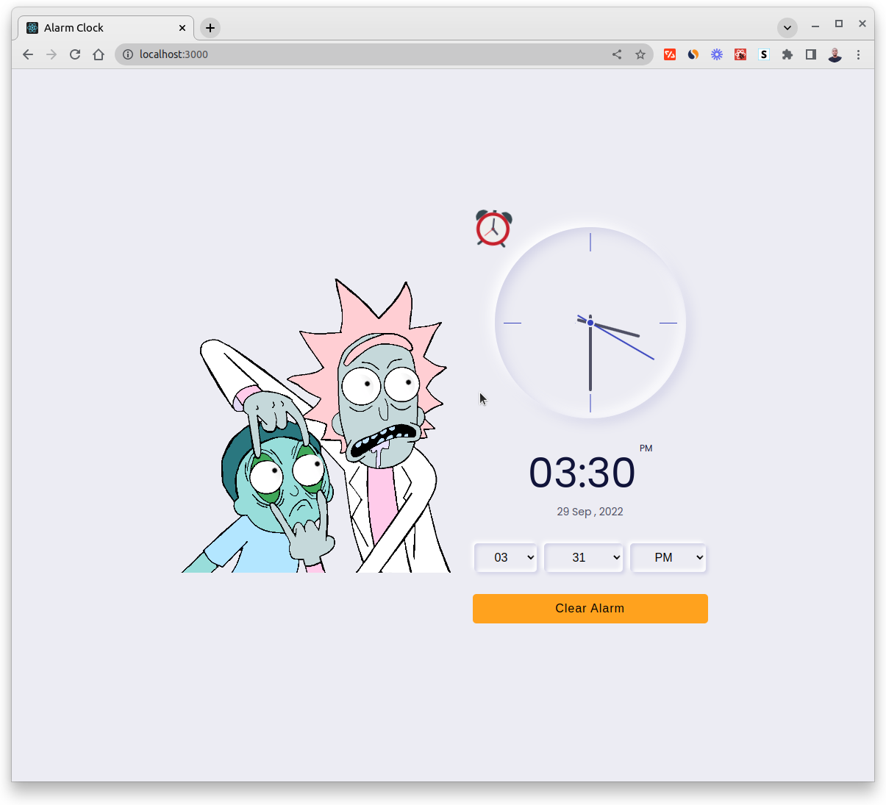

# Alarm Clock

[](https://react-alarm-clock.netlify.app/)

[](https://react-alarm-clock.netlify.app/)

## Technologies

- React
- React Context
- CSS

### Package in Project:

- React Icons

### Feature

- Analog Clock
- Digital Clock
- Date "day--Year--Month"
- Set Alarm
- Eyes moving on `mousemove` event

## Setup

```code
# Clone the repo
git clone https://github.com/hesbon-osoro/alarm-clock.git

# Navigate the directory and install packages
cd alarm-clock && yarn

# Start the App
yarn start
```
